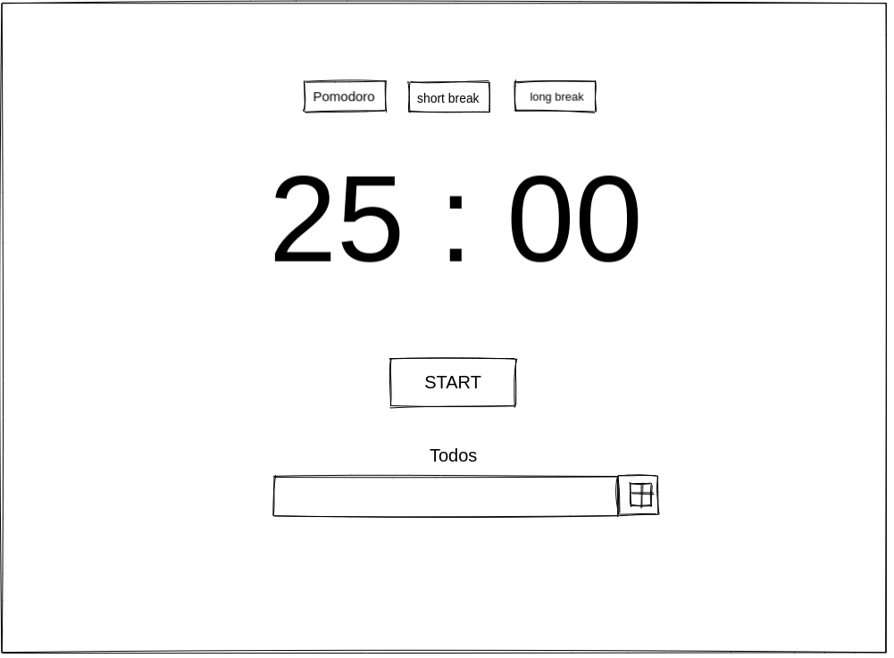

# Pomofocus

JavaScript Promofocus

---

## Data

> describe the data used in your project.
>
> - what properties?
> - what types?
> - what are array entries like?

---

## User Story Dependencies

---

## WIREFRAME

---

## 0.Setup

**A User can see my initial repository and live demo**

### Repository

- Created a new repository from this [template](https://github.com/HackYourFutureBelgium/classes-starter)
- Clone the repository
- Add a Wireframe
- Start the development strategy
- Write initial, basic README
- Push the changes to GitHub

---

## 1. Initialize Application

**As a user I want to see the home page when I load the site**

### REPO

- This user story is developed on branch `master`.

### Index.html

- Add `index.html `
- Add elements

### Style.css

- Added style for elements

### Images and sound

- Add images and sound

---

## 2. Time

**As a user I would like be able to set the time to study for long break and short break**

### REPO

- This user story is developed on branch `time`.
- This branch is merged to `master` branch after completion.

### Time.js

- Create functions to make the timer work

### Time.js

- Create a `start` and `stop button work`  
- Create a `pomodoro` , `short break` and long `break work `

### init.js

- All the listeners

---

## 3. Background colors

**As a user I would like be able to see different background colors for long break and short break**

### REPO

- This user story is developed on branch `background`.
- This branch is merged to `master` branch after completion.

### background.js

- Create functions to change background colors.

---
